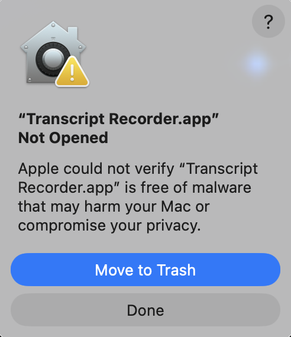
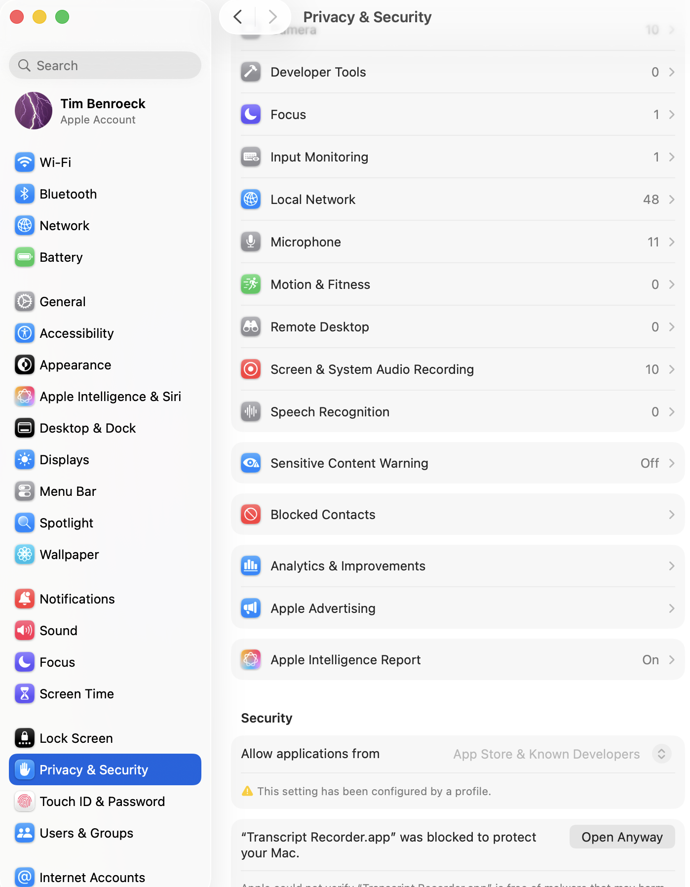
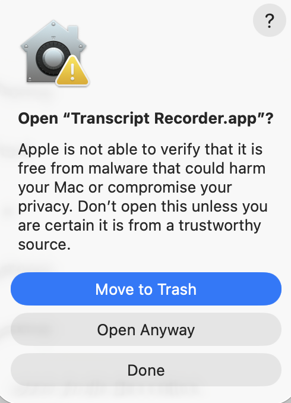
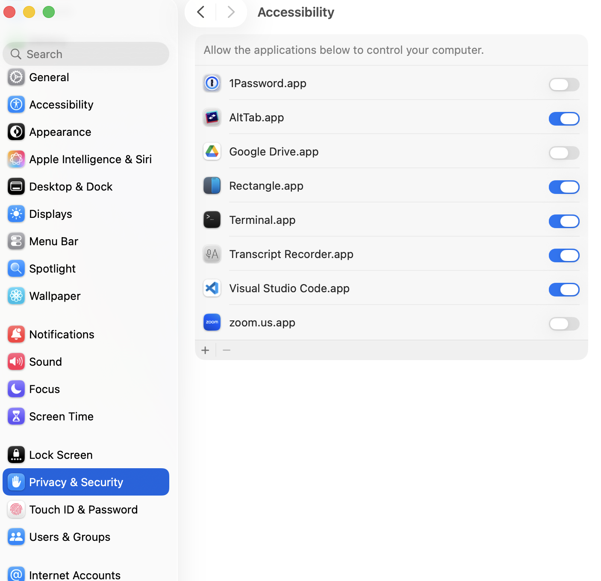

# Transcript Recorder

A macOS application that captures meeting transcripts and live captions using the macOS Accessibility API. Designed for users who want to save and review meeting transcripts from popular video conferencing applications.

## Features

- **Multi-Application Support**: Works with Zoom, Microsoft Teams, WebEx, and Slack
- **Real-Time Capture**: Automatically captures transcript updates at configurable intervals
- **Smart Merging**: Intelligently merges transcript snippets to avoid duplicates
- **Native macOS UI**: Modern PyQt6 interface with light/dark mode support
- **Meeting Details**: Add meeting name, notes, and timestamps to your recordings
- **Auto-Updates**: Check for and install updates directly from the app
- **Configurable**: JSON-based configuration for each meeting application

## Requirements

- **macOS 12.0 (Monterey)** or later
- **Python 3.11+** (for running from source)
- **Accessibility Permissions**: The app requires accessibility access to read transcript content

## Installation

### From Release (Recommended)

1. Download the latest `.dmg` file from [Releases](../../releases)
2. Open the DMG and drag "Transcript Recorder" to your Applications folder
3. Follow the steps below to allow the unsigned app and grant required permissions

#### Allowing the Unsigned App

Since Transcript Recorder is not signed with an Apple Developer certificate, macOS will block it on first launch. Follow these steps to allow it:

**Step 1: Dismiss the blocked app warning**

When you first open the app, macOS will display a warning that it cannot verify the developer. Click **Done** to dismiss the dialog.



**Step 2: Allow the app in System Settings**

Open **System Settings → Privacy & Security**. Scroll down to the Security section where you will see a message about "Transcript Recorder" being blocked. Click **Open Anyway**.



**Step 3: Confirm opening the app**

A confirmation dialog will appear. Click **Open Anyway** to launch the app.



#### Granting Accessibility Permissions

Transcript Recorder uses the macOS Accessibility API to read transcript content from meeting applications. After the app opens for the first time, you must grant it Accessibility access:

1. Open **System Settings → Privacy & Security → Accessibility**
2. Find **Transcript Recorder.app** in the list
3. Toggle the switch to **enable** it



> **Note:** If Transcript Recorder does not appear in the Accessibility list, click the **+** button, navigate to your Applications folder, and add it manually. You may need to restart the app after granting permissions.

## Usage

### Quick Start

1. **Launch** Transcript Recorder
2. **Grant Accessibility Permissions** when prompted (System Settings → Privacy & Security → Accessibility)
3. **Select** your meeting application from the dropdown
4. **Click "New Recording"** to start a new session
5. **Join your meeting** and enable captions/transcripts in the meeting app
6. **Click "Capture Now"** for manual capture, or **"Start Auto Capture"** for continuous recording

### Recording Workflow

1. **New Recording**: Creates a new recording session with a timestamped folder
2. **Capture Now**: Takes a single snapshot of the current transcript
3. **Start Auto Capture**: Continuously captures at the configured interval (default: 30 seconds)
4. **Meeting Details**: Add a meeting name, notes, and adjust the date/time

### Output Files

Recordings are saved to `~/Documents/transcriptrecorder/recordings/`:

```
recordings/
└── recording_20240115_143022_Zoom/
    ├── meeting_transcript.txt      # Merged transcript
    ├── meeting_details.txt         # Meeting metadata
    └── .snapshots/                 # Individual capture snapshots
        ├── snapshot_001.txt
        ├── snapshot_002.txt
        └── snapshots_index.json
```

## Configuration

The application is configured via `config.json` located at `~/Documents/transcriptrecorder/config.json`.

### Logging Settings

```json
{
  "logging": {
    "level": "INFO",           // DEBUG, INFO, WARNING, ERROR, CRITICAL
    "log_to_file": true,       // Write logs to file
    "log_file_name": "tr_client.log"
  }
}
```

### Application Settings

Each meeting application has its own configuration block:

```json
{
  "application_settings": {
    "zoom": {
      "display_name": "Zoom",
      "command_paths": ["/Applications/zoom.us.app/Contents/MacOS/zoom.us"],
      "rules_to_find_transcript_table": [...],
      "monitor_interval_seconds": 30
    }
  }
}
```

### Configuration Options

| Option | Description |
|--------|-------------|
| `display_name` | Name shown in the application dropdown |
| `command_paths` | Paths to detect if the application is running |
| `rules_to_find_transcript_table` | Rules to locate the transcript UI element |
| `traversal_mode` | `bfs` (breadth-first) or `dfs` (depth-first) search |
| `traversal_roles_to_skip` | Accessibility roles to skip during traversal |
| `serialization_text_element_roles` | Map of roles to attributes for text extraction |
| `serialization_export_depth` | How deep to traverse for text content |
| `monitor_interval_seconds` | Default capture interval |
| `exclude_pattern` | Regex pattern to filter out unwanted text |

### Adding a New Application

To add support for a new meeting application:

1. Open the config editor (View → Edit Configuration or `Cmd+Shift+,`)
2. Add a new entry under `application_settings`
3. Use macOS Accessibility Inspector to identify:
   - The application's command path
   - UI element roles and attributes for the transcript
4. Define rules to locate the transcript element
5. Save and reload configuration

## Meeting Tools

The **Meeting Tools** tab lets you run custom scripts against your recordings directly from the app. Tools are discovered automatically from the `tools/` directory inside your export folder (by default `~/Documents/transcriptrecorder/tools/`).

### Folder Structure

Each tool lives in its own sub-folder containing a JSON definition, a script, and an optional README:

```
tools/
└── summarize_meeting/
    ├── tool.json               # Tool metadata and parameter definitions
    ├── summarize_meeting.sh    # The script that gets executed
    └── README.md               # Optional documentation
```

On startup (and on configuration reload), the app scans each sub-folder of `tools/` for a `.json` file, verifies the referenced script exists, and populates the tool dropdown. To add a new tool, create a new sub-folder with a JSON + script pair — no app changes needed.

### JSON Definition Format

```json
{
  "display_name": "Summarize Meeting",
  "description": "Generate an AI-powered meeting summary.",
  "script": "summarize_meeting.sh",
  "parameters": [
    {
      "flag": "-m",
      "label": "Meeting Directory",
      "builtin": "meeting_directory",
      "required": true
    },
    {
      "flag": "-o",
      "label": "Output Directory",
      "default": "/path/to/output",
      "required": false
    }
  ]
}
```

#### Top-Level Fields

| Field | Required | Description |
|-------|----------|-------------|
| `display_name` | Yes | Name shown in the tool dropdown |
| `description` | No | Shown below the dropdown when the tool is selected |
| `script` | Yes | Filename of the script in the same sub-folder |
| `parameters` | No | Array of parameter definitions (see below) |

#### Parameter Fields

| Field | Required | Description |
|-------|----------|-------------|
| `flag` | Yes | Command-line flag passed to the script (e.g. `-m`, `--output`) |
| `label` | No | Human-readable name shown in the Parameters table |
| `builtin` | No | Auto-filled from the app's current state (see table below) |
| `default` | No | Default value used when `builtin` is not set |
| `required` | No | If `true`, the tool will refuse to run when the value is missing |

Parameters appear in an **editable table** in the app. Values pre-filled from `builtin` mappings or `default` values can be modified before clicking Run.

### Built-in Parameter Values

Parameters with a `"builtin"` key are automatically resolved at run-time:

| `builtin` value | Resolves to |
|-----------------|-------------|
| `meeting_directory` | Full path to the current recording folder |
| `meeting_transcript` | Full path to `meeting_transcript.txt` |
| `meeting_details` | Full path to `meeting_details.txt` |
| `export_directory` | Base export directory (`~/Documents/transcriptrecorder`) |
| `app_name` | Key of the selected application (e.g. `zoom`, `teams`) |

### Script Execution

- `.sh` / `.bash` scripts are run with `/bin/bash`
- `.py` scripts are run with the app's Python interpreter
- `.zsh` scripts are run with `/bin/zsh`
- Other extensions are executed directly (the script must have its execute bit set)

Scripts run in a background thread with a 5-minute timeout. The working directory is set to the tool's own sub-folder. Output (stdout and stderr) is displayed in the tool output area when the script finishes.

### Example: Adding a New Tool

1. Create a sub-folder in `~/Documents/transcriptrecorder/tools/`:

   ```
   mkdir ~/Documents/transcriptrecorder/tools/my_tool
   ```

2. Add your script (`my_tool.sh`):

   ```bash
   #!/bin/bash
   # my_tool.sh — does something useful with a recording
   echo "Processing meeting in: $2"
   ```

3. Add a JSON definition (`tool.json`):

   ```json
   {
     "display_name": "My Custom Tool",
     "description": "Does something useful with meeting recordings.",
     "script": "my_tool.sh",
     "parameters": [
       {
         "flag": "-m",
         "label": "Meeting Directory",
         "builtin": "meeting_directory",
         "required": true
       }
     ]
   }
   ```

4. Optionally add a `README.md` documenting the tool's purpose and requirements.

5. Reload the configuration (Maintenance → Reload Configuration) or restart the app. The tool will appear in the Meeting Tools dropdown.

## Menu Reference

### File

| Menu Item | Shortcut | Description |
|-----------|----------|-------------|
| **New Recording** | `Cmd+N` | Creates a new recording session with a timestamped folder |
| **Reset** | `Cmd+R` | Stops any active capture and resets the session, returning the UI to its initial state |
| **Open Export Folder** | `Cmd+O` | Opens the base export directory in Finder |

### Edit

| Menu Item | Shortcut | Description |
|-----------|----------|-------------|
| **Copy Transcript** | `Cmd+C` | Copies the current merged transcript text to the clipboard |

### View

| Menu Item | Shortcut | Description |
|-----------|----------|-------------|
| **Appearance** | | Submenu to switch between **System**, **Light**, and **Dark** themes |
| **Log File...** | `Cmd+L` | Opens a log viewer window showing the application log with refresh and clear options |
| **Preferences...** | `Cmd+,` | Opens the configuration editor (also available via the macOS app menu) |

### Maintenance

| Menu Item | Description |
|-----------|-------------|
| **Edit Configuration...** | Opens the JSON configuration editor where you can view, validate, save, or download a config from a URL |
| **Reload Configuration** | Reloads `config.json` from disk and refreshes the application dropdown without restarting |
| **Clear Log File** | Clears the contents of the application log file |
| **Clear All Snapshots** | Removes all `.snapshots` folders from past recordings while preserving merged transcripts |
| **Clear Empty Recordings** | Removes recording folders that contain no files (e.g. sessions that were started but never captured). Skips the currently active session |
| **Check Permissions** | Verifies that macOS Accessibility permissions are granted and prompts if not |
| **Check for Updates...** | Queries GitHub releases for a newer version and offers to download and install it |
| **About Transcript Recorder** | Shows version info, supported applications, and a link to the GitHub repository |

## Supported Applications

| Application | Status | Notes |
|-------------|--------|-------|
| **Zoom** | ✅ Supported | Works with transcript window and in-meeting captions |
| **Microsoft Teams** | ✅ Supported | Works with Live Captions feature |
| **WebEx** | ✅ Supported | Works with Captions window |
| **Slack** | ✅ Supported | Works with Huddle transcripts |

## Troubleshooting

### "Accessibility permission required"

See [Granting Accessibility Permissions](#granting-accessibility-permissions) above for detailed instructions with screenshots.

1. Open **System Settings** → **Privacy & Security** → **Accessibility**
2. Click the **+** button and add Transcript Recorder
3. Ensure the toggle is enabled
4. Restart the application

### Transcript not capturing

- Ensure captions/transcripts are **enabled** in your meeting application
- Make sure the transcript **window is visible** (not minimized)
- Try clicking **"Capture Now"** to test manual capture
- Check the **log file** (View → Log File) for error details

### Application not detected

- Verify the meeting app is **running**
- Check that the `command_paths` in config.json match your installation
- Some apps (like Teams) may run from different paths depending on how they were installed


## License

MIT License - See LICENSE file for details.

## Acknowledgments

- Built with [PyQt6](https://www.riverbankcomputing.com/software/pyqt/)
- Uses [pyobjc](https://pyobjc.readthedocs.io/) for macOS Accessibility API access
